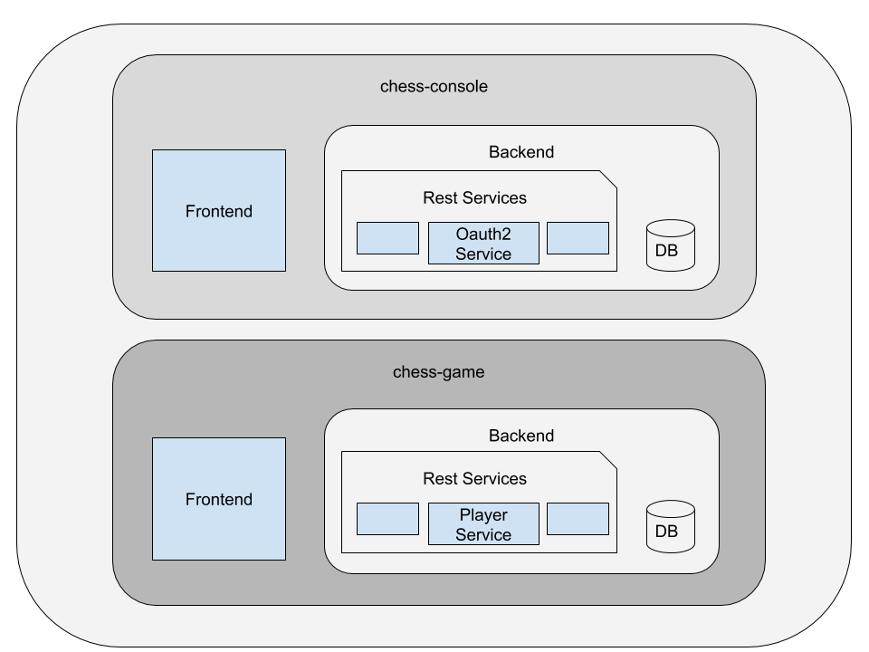
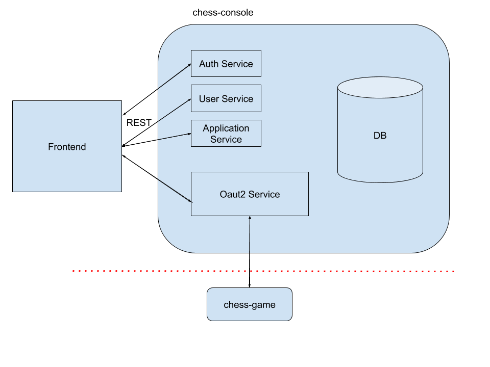
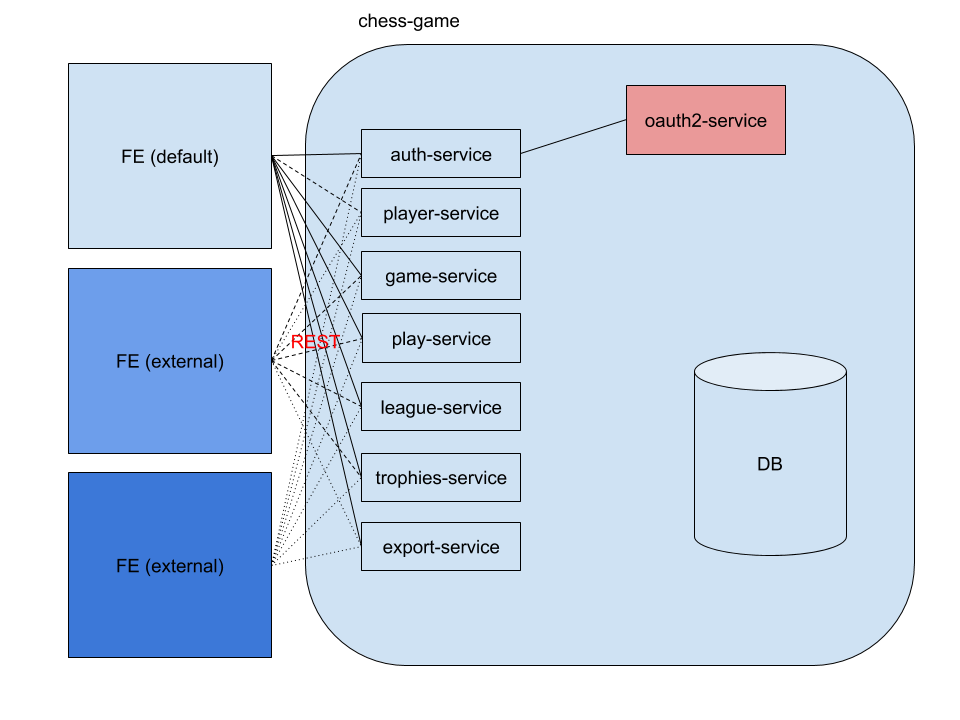

<!-- START doctoc generated TOC please keep comment here to allow auto update -->
<!-- DON'T EDIT THIS SECTION, INSTEAD RE-RUN doctoc TO UPDATE -->
**Table of Contents**  *generated with [DocToc](https://github.com/thlorenz/doctoc)*

- [distributed chess game](#distributed-chess-game)
  - [prerequisites](#prerequisites)
  - [stacks](#stacks)
  - [applications](#applications)
    - [chess-console](#chess-console)
      - [microservices](#microservices)
      - [APIs/documentation](#apisdocumentation)
      - [database](#database)
    - [chess-game](#chess-game)
      - [external front-end](#external-front-end)
      - [microservices](#microservices-1)
      - [APIs/documentation](#apisdocumentation-1)
      - [database](#database-1)
      - [caching](#caching)
  - [deployment](#deployment)

<!-- END doctoc generated TOC please keep comment here to allow auto update -->

# distributed chess game

This application is a distributed chess game server design. The application supports to create players, leagues and trophies. And also the player can play chess games and the games can be saved, paused and resumed.

The application has 2 different main applications. The applications are `chess-console` and `chess-game`.
- chess-console: The chess-console is responsible for the authorization and the authentication part of the application. Basically, the console allows to create a development client with client Id/secret and to manage the grands of the client. It has a backend and a frontend parts. The backend feeds a `oauth2` server for the `chess-game`. And also it has all necessary resources to manage/configure the authentication/authorization of the application. 

- chess-game: The chess-game is the main of the game. It has a backend and frontend applications. The backend is designed as microservices. And all microservices has secure oauth2 APIs. The frontend is the default oauth2 client of the application.
 
 

## prerequisites
- JDK1.8
- gradle
- docker
- docker-compose

## stacks
- Spring Boot
- Oauth2
- Hibernate/JPA
- Redis
- Postgresql
- Lombok
- Flyway
- Swagger
- pojo-tester
- [pdfbox](https://pdfbox.apache.org/)
 
## applications

### chess-console

`chess-console` is a management application for oauth2 clients. A new developer can create a user and the user can create a clients with `clientId` and `clientSecret`. 
The clients are authorized for `chess-game` APIs. A developer can create a new frontend (web/mobile) application by using a client. 

The `chess-console` app designed as Spring Microservices application.

#### microservices

 All services has their own HTTPS REST services. 

- auth-service: auth-service is an authentication and authorization service for `chess-console` user. A registered user is able to create a client. A user can register/login to `chess-console` and start to manage clients.

- client-service: API to create new clients with clientId and clientSecret. The microservice also allows to manage spoces and authorized users for the client. Client service has token based protection.

- oauth2-service: `oauth2-service` is the authentication and authorization for `chess-game`. `client-service` and new registrations to `chess-game` feed the `oauth2-service`.

#### APIs/documentation

`swagger` is used for API documentation. The swagger UIs for `auth-service` and `client-service` are private; for `oauth2-service` is public.

#### database
The database is `postgresql`. A relational database is more secure for data consistency.

This database contains console_user, console_user_role, the tables for `oauth2` (user_info, scope, applications, application_scope, application_user).
Flyway executes all scripts to create or migrate table/table data.

All database models has `hibernate/JPA` descriptions. 
 
### chess-game

`chess-game` is an application for multiplayer chess game service with league, trophies. Admins can create league and trophies. Players can register/login to system and join a league and win trophies.

`chess-game` has 2 roles.
- admin: user who can authorized to create resources (league, trophies, game) 
- player: user who can join a league, play game and win trophies 

#### external front-end
External front-ends can access the game resources if they have a clientId and clientSecret. External FEs authenticate users over `oauth2-service` and have a valid access token. 
With the valid access token, they can access `chess-game` APIs. All APIs have their own documentation. External FEs can integrate to `chess-game` API according to specifications in the documents.

#### microservices
- auth-service: manages login/register of users
- player-service: list services for player with/without trophies
- game-service: save/pause/resume game
- play-service:  manages movement in a game. Decides the movement available or no. And decides to winner. 
- league-service: create/update/delete services for leagues. create/update/delete is an ADMIN authorization. All users can retrieve all leagues.
- trophies-service: create/update/delete services for trophies. create/update/delete is an ADMIN authorization. All users can retrieve all trophies.
- export-service: the service for exporting data as PDF in the system. The export data can be a league schedule/score table table, game result and details, player ratings. `pdfbox` is used to create pdf files.
 
#### APIs/documentation

`swagger` is used for API documentation. The swagger UIs for `auth-service`  is private; for the other service is public. The swagger definitions must contains authentications and authorizations.

#### database

The database is `postgresql`. A relational database is more secure for data consistency.
Flyway executes all scripts to create or migrate table/table data.

All database models has `hibernate/JPA` descriptions. 

#### caching

`chess-game` needs caching some data to speed up. The data especially, user data which is coming in access_token. The APIs need to validate the users and services need to know who owner is. 
Normally, the data is in database. But going to database to have user data for all request, brings extra load to the system. In distributed systems the cache must be external. 
`Redis` is used in this application

## deployment

All microservices has their own `Dockerfile`s. The `docker` files contains all configurations to run the app and integrate the app with the other microservices. 

`docker-compose` builds all `docker` images and run the docker containers with necessary scaling.